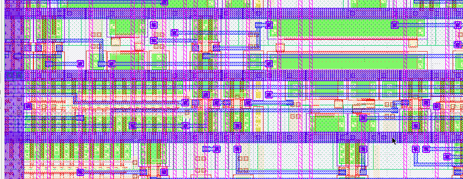

# sky130_as_sc_hs



### Custom Standard Cell Library

sky130_as_sc_hs is a custom standard cell library for the sky130A PDK that is compatible with the default OpenLane flow in caravel and openframe wrappers.

The eventual goal is it to build a high-speed library that gives a performance edge at the cost of decreased density. Right now, the library is still deep in development, but already appears to deliver better results than sky130_fd_sc_hd.

This project makes use of [lctime](https://codeberg.org/librecell/lctime) for characterization.

## Usage

After cloning this repo and setting up your user project (caravel or openframe), copy the contents of the `pdk/` directory (`libs.ref/` and `libs.tech/`) from here to `your_user_project/dependencies/pdks/sky130A/`, merging with the existing directory structure and overwriting existing files if prompted.

Edit the openlane config file for the macro you wish to use this library, and add/edit the following lines:

`"STD_CELL_LIBRARY": "sky130_as_sc_hs"`
and
`"STD_CELL_LIBRARY_OPT": "sky130_as_sc_hs"`
to switch to the library.

Then, `"RUN_CVC": 0` as the Circuit Validity Check is not yet supported.

Within the section `"pdk::sky130*"`, add an entry for this library:
```json
"scl::sky130_as_sc_hs": {
	"CLOCK_PERIOD": 30
}
```

The klayout XOR check will fail if the GDSII of the standard cells is not linked to explicitly, so either add this list/copy the entry to an existing one:
```json
"EXTRA_GDS_FILES": [
	"dir::../../dependencies/pdks/sky130A/libs.ref/sky130_as_sc_hs/sky130_as_sc_hs__merged.gds"
]
```
or disable the XOR check:
`"RUN_KLAYOUT_XOR": 0`

From there, the makefile actions to run the OpenLane flow should work as normal.

## Work in progress

Currently, there are two areas in which progress is being made on this library. The first is expand the amount of combinatorial logic cells available, as a lot of basic logic is still missing, followed by more specific merge cells.

I am also experimenting with different ways of constructing DFFs that will hopefully have improved timing characteristics over the traditional leader/follower DFF already in the library.

These are the cells I am going to work on next, ordered by priority:

1. xnor2_2 (potentially using faster alternative design)
2. nand3_2
3. nand3b_2
4. nor3b_2
5. dfxtp_2 (DFF with noninverting output, higher drive strength)
6. dfxbp_2 (DFF with complementary outputs)
7. dfxtn_2 (DFF, latching on falling edge)
8. dfxbn_2 (DFF with complementary outputs, latching on falling edge)
9. fa_2 (full adder)
10. Slimmer tie cells
